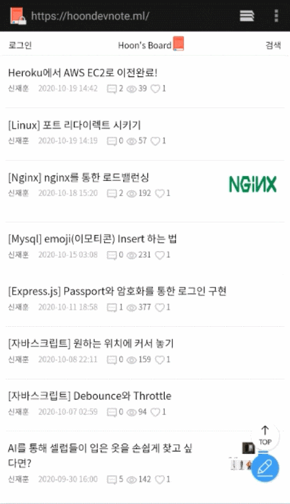
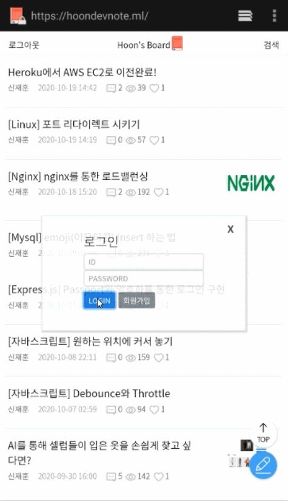
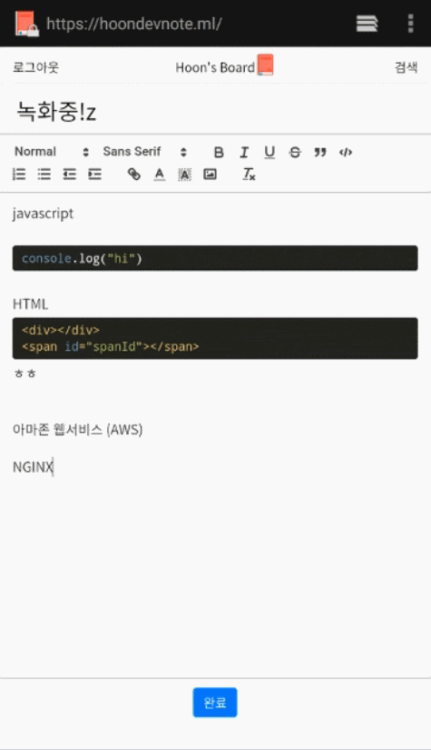
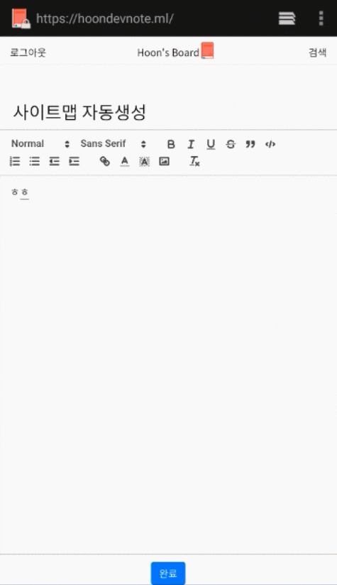

<h1 align="center" style="color:blue">Welcome to HoonBoard   👋</h1>

  

>## SPA Board

### `Description`
- It is a board that makes use of the characteristics of `SPA`.
- Used quill Editor and the `custom photo upload logic` perfectly responds to any position of the cursor.
- Made with `infinite scrolling` on mobile and numeric paging on PC.
- In particular, in the infinite scrolling, the load caused by the accumulated nodes was solved through `react-virtualize`.

### `Stack`
- React
- Node Express
- AWS S3
- Mysql
- Redux
- Passport

### `Images`

### Scroll Paging

 

### Sign Up & Login

 

### Posting

 

### Re-render after Login & Logout

 

### Comment

 

### Searching

 

### Upload Image

 

### Dynamic sitemap Update

### 🏠 [Homepage](https://hoondevnote.ml)

## Author

👤 **JAEHUN SHIN  **

* Website: https://hoonsbory.github.io/MyGitPage
* Github: [@hoonsbory  ](https://github.com/hoonsbory  )

## Show your support

Give a ⭐️ if this project helped you!

***
_This README was generated with ❤️ by [readme-md-generator](https://github.com/kefranabg/readme-md-generator)_
